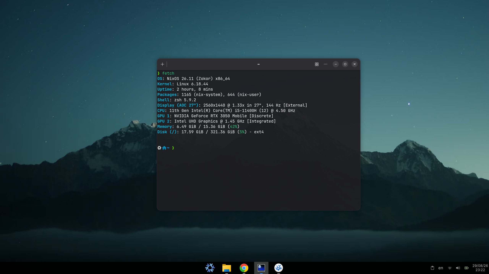

# NixOS Configuration



Personal NixOS and Home Manager configurations structured for modularity, reproducibility, and clean management across multiple machines.

## Project Structure

```text
~/.nixos-config/
├── .vscode
├── assets
│   ├── cursors
│   │   ├── moga-dark
│   │   └── moga-white
│   └── wallpapers
│       └── mountains
├── hosts
│   ├── laptop
│   │   └── gnome
│   └── wsl
└── modules
    ├── core
    ├── desktop
    ├── lib
    ├── programs
    │   ├── apps
    │   └── cli
    │       └── zsh
    └── services
```

## Directory Overview

- **`hosts/`**: Machine-specific configurations. Separates host definitions (such as the primary `laptop` running GNOME and the `wsl` environment).
- **`modules/`**: Reusable configuration blocks divided by domain:
  - **`core/`**: Base system settings, users, localization, and core policies.
  - **`desktop/`**: Window managers, desktop environments, and UI themes.
  - **`services/`**: System services (audio/PipeWire, networking, etc.).
  - **`programs/`**: User software categorized into graphical applications (`apps`) and command-line tools (`cli/zsh`).
  - **`lib/`**: Custom helper functions or shared logic.
- **`assets/`**: Static resources including themes, cursor packs (`moga-dark`, `moga-white`), and wallpapers.

## Prerequisites & Secrets

This configuration relies on an external local secrets file located outside the repository to keep credentials secure.

Create a file named `.nixos-secrets.nix` in your home directory (`/home/YOUR_USERNAME/.nixos-secrets.nix`):

```nix
{
  home-wifi-password = "your_actual_password";
}